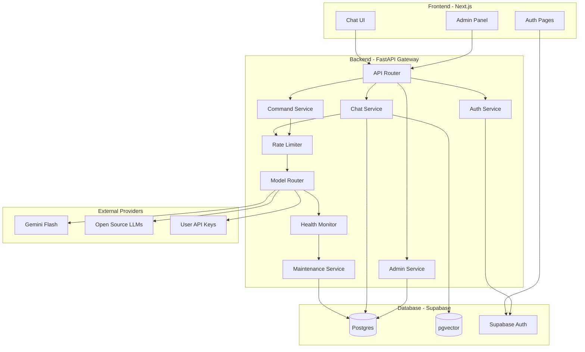

# Design Document: Medical AI Platform

## Overview

The Medical AI Platform is a production-grade SaaS application designed for medical students with a scarcity-first engineering approach. The system provides AI-powered tutoring, study tools, clinical simulations, and comprehensive administrative controls while assuming API limitations, quota exhaustion, and zero initial budget.

The architecture follows a three-tier model:
1. **Frontend**: Next.js web application (responsive, chat-centric)
2. **Backend**: FastAPI gateway (async, modular, single source of truth)
3. **Database**: Supabase (Postgres + Auth + pgvector)

Core design principles:
- **Scarcity-first**: Assume APIs will fail, quotas will exhaust, money is limited
- **Admin control**: Full manual control over API keys, features, and maintenance
- **Backend authority**: All business logic, rate limiting, and security server-side
- **Graceful degradation**: Automatic maintenance mode instead of silent quality loss
- **Local-first**: Complete functionality on localhost before any deployment

## Architecture

### System Architecture



### Data Flow

**User Request Flow:**
1. User interacts with Next.js frontend
2. Frontend sends authenticated request to FastAPI backend
3. Backend validates authentication with Supabase Auth
4. Backend checks rate limits against usage_counters table
5. Backend routes request to appropriate service (Chat, Command, etc.)
6. Service uses Model Router to select provider and API key
7. Model Router checks provider health and selects best available key
8. Request sent to external AI provider
9. Response streamed back through backend to frontend
10. Usage counters updated in database

**Admin Action Flow:**
1. Admin accesses admin panel (protected route)
2. Backend verifies admin status (allowlist + role check)
3. Admin performs action (add key, toggle feature, etc.)
4. Backend validates and executes action
5. Action logged to audit_logs table
6. Notification sent to other admins if critical

**Maintenance Trigger Flow:**
1. Health Monitor detects all keys failed for a feature
2. Maintenance Service evaluates severity
3. System enters soft or hard maintenance mode
4. system_flags table updated
5. Admin notification sent
6. Frontend displays maintenance UI
7. Admin can manually override if needed

## Components and Interfaces

### Frontend Components (Next.js)

#### 1. Authentication Pages
- **Login/Register**: Supabase Auth integration
- **Password Reset**: Email-based recovery
- **Profile**: User settings and optional API key management

#### 2. Chat Interface (Default Experience)
- **Chat Window**: Message display with streaming support
- **Input Bar**: Text input with slash command autocomplete
- **Session Sidebar**: Chat history navigation
- **Context Panel**: Active documents for RAG

#### 3. Study Tools
- **Flashcard Viewer**: Spaced repetition interface
- **MCQ Practice**: Multiple choice question interface
- **Concept Map Viewer**: Visual concept relationships
- **Study Planner**: Calendar and session management

#### 4. Clinical Tools
- **Clinical Reasoning Mode**: Case-based scenario interface
- **OSCE Simulator**: Structured examination interface

#### 5. Document Management (Optional)
- **Upload Interface**: PDF and image upload
- **Document Library**: Uploaded document management
- **Processing Status**: Upload and embedding progress

#### 6. Admin Panel (Hidden Route)
- **User Management**: User list, plan assignment, usage reset
- **API Key Management**: Add, view, edit, delete keys
- **Provider Health**: Status dashboard and failure logs
- **Feature Toggles**: Enable/disable features globally
- **Maintenance Control**: Manual maintenance mode control
- **Audit Logs**: Searchable admin action history
- **Notifications**: Alert configuration and history

### Backend Services (FastAPI)

#### 1. API Router (`main.py`)
```python
# Central FastAPI application
# Routes:
# - /api/auth/* → AuthService
# - /api/chat/* → ChatService
# - /api/commands/* → CommandService
# - /api/admin/* → AdminService
# - /api/health → Health check
# CORS configuration for Next.js frontend
# Global exception handling
# Request logging middleware
```

#### 2. Auth Service (`services/auth.py`)
```python
# authenticate_user(email, password) → User
# register_user(email, password, name) → User
# verify_admin(user_id) → AdminRole | None
# check_admin_allowlist(email) → bool
# get_user_plan(user_id) → Plan
# Emergency admin check via SUPER_ADMIN_EMAIL env var
```

#### 3. Chat Service (`services/chat.py`)
```python
# send_message(user_id, session_id, message) → StreamingResponse
# get_chat_history(user_id, session_id) → List[Message]
# create_session(user_id, title) → Session
# get_user_sessions(user_id) → List[Session]
# Uses RAG when user has documents
# Integrates with RateLimiter and ModelRouter
```

#### 4. Command Service (`services/commands.py`)
```python
# execute_command(user_id, command, topic) → Response
# Supported commands:
# - /flashcard <topic> → generate_flashcards()
# - /mcq <topic> → generate_mcqs()
# - /highyield <topic> → generate_summary()
# - /explain <topic> → generate_explanation()
# - /map <topic> → generate_concept_map()
# Each command tracks specific usage metrics
```

#### 5. Rate Limiter (`services/rate_limiter.py`)
```python
# check_rate_limit(user_id, feature) → bool
# increment_usage(user_id, tokens, feature) → None
# get_user_usage(user_id) → UsageStats
# reset_daily_counters() → None (scheduled job)
# Plan limits defined as constants
# Admin bypass logic
```

#### 6. Model Router (`services/model_router.py`)
```python
# route_request(feature, prompt, user_id) → Response
# select_provider(feature) → Provider
# get_active_key(provider, feature) → APIKey
# execute_with_fallback(provider, key, prompt) → Response
# Handles provider-specific formatting
# Automatic retry with next key on failure
# User-supplied key priority
```

#### 7. Health Monitor (`services/health_monitor.py`)
```python
# check_provider_health(provider, key) → HealthStatus
# periodic_health_check() → None (background task)
# record_failure(key_id, error) → None
# mark_key_degraded(key_id) → None
# get_provider_status(provider, feature) → Status
# Minimal test calls to avoid quota waste
```

#### 8. Maintenance Service (`services/maintenance.py`)
```python
# evaluate_maintenance_trigger(feature, failures) → MaintenanceLevel
# enter_maintenance(level, reason) → None
# exit_maintenance() → None
# get_maintenance_status() → MaintenanceStatus
# notify_admins(event) → None
# Soft vs Hard maintenance logic
```

#### 9. Admin Service (`services/admin.py`)
```python
# User Management:
# - list_users(filters) → List[User]
# - update_user_plan(user_id, plan) → User
# - reset_user_usage(user_id) → None
# - disable_user(user_id) → None
#
# API Key Management:
# - add_api_key(provider, feature, key, priority) → APIKey
# - list_api_keys() → List[APIKey]
# - update_key_status(key_id, status) → APIKey
# - delete_api_key(key_id) → None
# - test_api_key(key) → bool
#
# Feature Management:
# - toggle_feature(feature, enabled) → None
# - get_feature_status() → Dict[str, bool]
#
# Maintenance Management:
# - trigger_maintenance(level, message) → None
# - override_maintenance() → None
#
# Audit & Logs:
# - get_audit_logs(filters) → List[AuditLog]
# - log_admin_action(admin_id, action, details) → None
```

#### 10. Document Service (`services/documents.py`)
```python
# upload_document(user_id, file) → Document
# process_pdf(document_id) → None (async)
# generate_embeddings(text) → List[float]
# semantic_search(user_id, query, top_k) → List[Chunk]
# get_user_documents(user_id) → List[Document]
# delete_document(document_id) → None
# Uses pgvector for similarity search
```

#### 11. Notification Service (`services/notifications.py`)
```python
# send_email(to, subject, body) → None
# send_webhook(url, payload) → None
# notify_api_key_failure(key_id, error) → None
# notify_fallback(from_key, to_key) → None
# notify_maintenance_triggered(level, reason) → None
# notify_admin_override(admin_id, action) → None
```

### External Interfaces

#### Supabase Auth API
```
POST /auth/v1/signup
POST /auth/v1/token (login)
POST /auth/v1/recover (password reset)
GET /auth/v1/user (get current user)
```

#### Supabase Database API
```
Uses Supabase Python client for database operations
Respects RLS policies
Connection pooling configured
```

#### Gemini Flash API
```
POST https://generativelanguage.googleapis.com/v1/models/gemini-flash:generateContent
Streaming support
Free tier quotas
```

#### Open Source LLM APIs
```
Provider-specific endpoints (e.g., Ollama, LocalAI)
Fallback when Gemini exhausted
Self-hosted or community-hosted
```

## Data Models

### Database Schema

#### users
```sql
CREATE TABLE users (
  id UUID PRIMARY KEY DEFAULT uuid_generate_v4(),
  email TEXT UNIQUE NOT NULL,
  name TEXT,
  plan TEXT NOT NULL DEFAULT 'free', -- free, student, pro, admin
  role TEXT, -- super_admin, admin, ops, support, viewer
  personal_api_key TEXT, -- encrypted, optional
  created_at TIMESTAMPTZ DEFAULT NOW(),
  updated_at TIMESTAMPTZ DEFAULT NOW(),
  disabled BOOLEAN DEFAULT FALSE
);
```

#### admin_allowlist
```sql
CREATE TABLE admin_allowlist (
  id UUID PRIMARY KEY DEFAULT uuid_generate_v4(),
  email TEXT UNIQUE NOT NULL,
  role TEXT NOT NULL, -- super_admin, admin, ops, support, viewer
  added_by UUID REFERENCES users(id),
  created_at TIMESTAMPTZ DEFAULT NOW()
);
```

#### usage_counters
```sql
CREATE TABLE usage_counters (
  id UUID PRIMARY KEY DEFAULT uuid_generate_v4(),
  user_id UUID REFERENCES users(id) ON DELETE CASCADE,
  date DATE NOT NULL DEFAULT CURRENT_DATE,
  tokens_used INTEGER DEFAULT 0,
  requests_count INTEGER DEFAULT 0,
  pdf_uploads INTEGER DEFAULT 0,
  mcqs_generated INTEGER DEFAULT 0,
  images_used INTEGER DEFAULT 0,
  flashcards_generated INTEGER DEFAULT 0,
  UNIQUE(user_id, date)
);
```

#### api_keys
```sql
CREATE TABLE api_keys (
  id UUID PRIMARY KEY DEFAULT uuid_generate_v4(),
  provider TEXT NOT NULL, -- gemini, openai, ollama, etc.
  feature TEXT NOT NULL, -- chat, flashcard, mcq, image, etc.
  key_value TEXT NOT NULL, -- encrypted
  priority INTEGER NOT NULL DEFAULT 0, -- higher = preferred
  status TEXT NOT NULL DEFAULT 'active', -- active, degraded, disabled
  failure_count INTEGER DEFAULT 0,
  last_used_at TIMESTAMPTZ,
  created_at TIMESTAMPTZ DEFAULT NOW(),
  updated_at TIMESTAMPTZ DEFAULT NOW()
);
```

#### provider_health
```sql
CREATE TABLE provider_health (
  id UUID PRIMARY KEY DEFAULT uuid_generate_v4(),
  api_key_id UUID REFERENCES api_keys(id) ON DELETE CASCADE,
  checked_at TIMESTAMPTZ DEFAULT NOW(),
  status TEXT NOT NULL, -- healthy, degraded, failed
  response_time_ms INTEGER,
  error_message TEXT,
  quota_remaining INTEGER
);
```

#### system_flags
```sql
CREATE TABLE system_flags (
  id UUID PRIMARY KEY DEFAULT uuid_generate_v4(),
  flag_name TEXT UNIQUE NOT NULL, -- maintenance_mode, feature_chat_enabled, etc.
  flag_value TEXT NOT NULL, -- JSON or simple value
  updated_by UUID REFERENCES users(id),
  updated_at TIMESTAMPTZ DEFAULT NOW()
);
```

#### documents
```sql
CREATE TABLE documents (
  id UUID PRIMARY KEY DEFAULT uuid_generate_v4(),
  user_id UUID REFERENCES users(id) ON DELETE CASCADE,
  filename TEXT NOT NULL,
  file_type TEXT NOT NULL, -- pdf, image
  file_size INTEGER NOT NULL,
  storage_path TEXT NOT NULL,
  processing_status TEXT DEFAULT 'pending', -- pending, processing, completed, failed
  created_at TIMESTAMPTZ DEFAULT NOW()
);
```

#### embeddings
```sql
CREATE TABLE embeddings (
  id UUID PRIMARY KEY DEFAULT uuid_generate_v4(),
  document_id UUID REFERENCES documents(id) ON DELETE CASCADE,
  chunk_text TEXT NOT NULL,
  chunk_index INTEGER NOT NULL,
  embedding VECTOR(768), -- pgvector, dimension depends on model
  created_at TIMESTAMPTZ DEFAULT NOW()
);

CREATE INDEX ON embeddings USING ivfflat (embedding vector_cosine_ops);
```

#### chat_sessions
```sql
CREATE TABLE chat_sessions (
  id UUID PRIMARY KEY DEFAULT uuid_generate_v4(),
  user_id UUID REFERENCES users(id) ON DELETE CASCADE,
  title TEXT,
  created_at TIMESTAMPTZ DEFAULT NOW(),
  updated_at TIMESTAMPTZ DEFAULT NOW()
);
```

#### messages
```sql
CREATE TABLE messages (
  id UUID PRIMARY KEY DEFAULT uuid_generate_v4(),
  session_id UUID REFERENCES chat_sessions(id) ON DELETE CASCADE,
  role TEXT NOT NULL, -- user, assistant, system
  content TEXT NOT NULL,
  tokens_used INTEGER,
  citations JSONB, -- for RAG responses
  created_at TIMESTAMPTZ DEFAULT NOW()
);
```

#### subscriptions
```sql
CREATE TABLE subscriptions (
  id UUID PRIMARY KEY DEFAULT uuid_generate_v4(),
  user_id UUID REFERENCES users(id) ON DELETE CASCADE,
  plan TEXT NOT NULL,
  razorpay_subscription_id TEXT UNIQUE,
  status TEXT NOT NULL, -- active, cancelled, expired
  current_period_start TIMESTAMPTZ,
  current_period_end TIMESTAMPTZ,
  created_at TIMESTAMPTZ DEFAULT NOW(),
  updated_at TIMESTAMPTZ DEFAULT NOW()
);
```

#### payments
```sql
CREATE TABLE payments (
  id UUID PRIMARY KEY DEFAULT uuid_generate_v4(),
  user_id UUID REFERENCES users(id) ON DELETE CASCADE,
  subscription_id UUID REFERENCES subscriptions(id),
  razorpay_payment_id TEXT UNIQUE,
  amount INTEGER NOT NULL, -- in paise
  currency TEXT DEFAULT 'INR',
  status TEXT NOT NULL, -- success, failed, pending
  created_at TIMESTAMPTZ DEFAULT NOW()
);
```

#### audit_logs
```sql
CREATE TABLE audit_logs (
  id UUID PRIMARY KEY DEFAULT uuid_generate_v4(),
  admin_id UUID REFERENCES users(id),
  action_type TEXT NOT NULL, -- add_key, change_plan, toggle_feature, etc.
  target_type TEXT, -- user, api_key, feature, etc.
  target_id TEXT,
  details JSONB,
  created_at TIMESTAMPTZ DEFAULT NOW()
);

CREATE INDEX ON audit_logs(admin_id, created_at DESC);
CREATE INDEX ON audit_logs(action_type, created_at DESC);
```

### Row Level Security (RLS) Policies

#### users table
```sql
-- Users can read their own record
CREATE POLICY users_select_own ON users
  FOR SELECT USING (auth.uid() = id);

-- Admins can read all users
CREATE POLICY users_select_admin ON users
  FOR SELECT USING (
    EXISTS (
      SELECT 1 FROM admin_allowlist 
      WHERE email = (SELECT email FROM users WHERE id = auth.uid())
    )
  );
```

#### usage_counters table
```sql
-- Users can read their own usage
CREATE POLICY usage_select_own ON usage_counters
  FOR SELECT USING (user_id = auth.uid());

-- Admins can read all usage
CREATE POLICY usage_select_admin ON usage_counters
  FOR SELECT USING (
    EXISTS (
      SELECT 1 FROM admin_allowlist 
      WHERE email = (SELECT email FROM users WHERE id = auth.uid())
    )
  );
```

#### Admin tables (api_keys, admin_allowlist, audit_logs, etc.)
```sql
-- Only admins can access
CREATE POLICY admin_only ON api_keys
  FOR ALL USING (
    EXISTS (
      SELECT 1 FROM admin_allowlist 
      WHERE email = (SELECT email FROM users WHERE id = auth.uid())
    )
  );
```

#### documents, embeddings, chat_sessions, messages
```sql
-- Users can only access their own data
CREATE POLICY documents_own ON documents
  FOR ALL USING (user_id = auth.uid());

CREATE POLICY sessions_own ON chat_sessions
  FOR ALL USING (user_id = auth.uid());
```

### Plan Limits Configuration

```python
PLAN_LIMITS = {
    "free": {
        "daily_tokens": 10000,
        "daily_requests": 20,
        "pdf_uploads": 0,
        "mcqs_per_day": 5,
        "images_per_day": 0,
        "flashcards_per_day": 10,
    },
    "student": {
        "daily_tokens": 50000,
        "daily_requests": 100,
        "pdf_uploads": 5,
        "mcqs_per_day": 50,
        "images_per_day": 10,
        "flashcards_per_day": 100,
    },
    "pro": {
        "daily_tokens": 200000,
        "daily_requests": 500,
        "pdf_uploads": 50,
        "mcqs_per_day": 200,
        "images_per_day": 50,
        "flashcards_per_day": 500,
    },
    "admin": {
        "daily_tokens": float('inf'),
        "daily_requests": float('inf'),
        "pdf_uploads": float('inf'),
        "mcqs_per_day": float('inf'),
        "images_per_day": float('inf'),
        "flashcards_per_day": float('inf'),
    }
}
```

## Correctness Properties


*A property is a characteristic or behavior that should hold true across all valid executions of a system—essentially, a formal statement about what the system should do. Properties serve as the bridge between human-readable specifications and machine-verifiable correctness guarantees.*

### Property Reflection

After analyzing all acceptance criteria, I identified the following areas of potential redundancy:

1. **User registration and authentication** (1.2, 1.3) - These can be combined into a single property about user creation and data retrieval
2. **Rate limiting checks** (9.2, 9.3, 9.6) - These overlap significantly and can be consolidated into comprehensive rate limiting properties
3. **API key encryption** (10.1, 10.5) - Both test encryption, can be combined
4. **Maintenance triggering** (12.1, 12.2, 12.3) - All test maintenance triggers, can be consolidated
5. **Admin notifications** (11.7, 12.9, 18.1-18.4) - Multiple notification properties can be consolidated
6. **Logging properties** (11.6, 19.1-19.6) - Can be consolidated into comprehensive logging properties

After reflection, I've eliminated redundant properties and combined related ones to ensure each property provides unique validation value.

### Core Properties

**Property 1: User registration assigns default plan**
*For any* new user registration, the user should be assigned the "free" plan by default.
**Validates: Requirements 1.2**

**Property 2: Admin access requires allowlist and role**
*For any* email and role combination, admin access should be granted if and only if the email is in the admin_allowlist AND the role permits access.
**Validates: Requirements 2.2**

**Property 3: Emergency admin access via environment variable**
*For any* email matching SUPER_ADMIN_EMAIL environment variable, super_admin access should be granted regardless of database state.
**Validates: Requirements 2.4**

**Property 4: Emergency admin token grants access**
*For any* request with a valid emergency admin token, super_admin access should be granted.
**Validates: Requirements 2.6**

**Property 5: Non-admin users cannot access admin routes**
*For any* user without admin role, requests to admin panel routes should be rejected with 403 Forbidden.
**Validates: Requirements 2.7**

**Property 6: Messages are routed to backend**
*For any* user message sent from the frontend, the message should reach the backend API gateway.
**Validates: Requirements 3.2**

**Property 7: Chat responses are streamed**
*For any* chat request, the response should be delivered as a stream (not fully buffered before sending).
**Validates: Requirements 3.3**

**Property 8: Messages persist to database**
*For any* message sent in a chat session, the message should appear in the messages table with correct session_id, role, and content.
**Validates: Requirements 3.4**

**Property 9: Message rendering includes metadata**
*For any* rendered message, the output should contain both timestamp and sender identification.
**Validates: Requirements 3.5**

**Property 10: Slash commands route to correct handlers**
*For any* valid slash command (/flashcard, /mcq, /highyield, /explain, /map), the system should invoke the corresponding command handler.
**Validates: Requirements 4.1, 4.2, 4.3, 4.4, 4.5**

**Property 11: Command usage is tracked separately**
*For any* command execution, the corresponding usage counter (mcqs_generated, flashcards_generated, etc.) should be incremented by the appropriate amount.
**Validates: Requirements 4.7**

**Property 12: Clinical reasoning presents cases progressively**
*For any* clinical reasoning session, patient cases should be presented in sequential order without skipping.
**Validates: Requirements 5.3**

**Property 13: OSCE mode generates examiner interactions**
*For any* OSCE simulation session, examiner responses should be generated for user actions.
**Validates: Requirements 5.4**

**Property 14: Study plan CRUD operations work correctly**
*For any* study plan created, it should be retrievable, updatable, and deletable by the owning user.
**Validates: Requirements 6.1, 6.2, 6.3, 6.4**

**Property 15: PDF upload generates embeddings**
*For any* uploaded PDF file, text extraction and embedding generation should complete successfully, resulting in embeddings stored in the database.
**Validates: Requirements 7.2**

**Property 16: Upload counts tracked against quotas**
*For any* PDF or image upload, the corresponding counter (pdf_uploads or images_used) should be incremented for the user.
**Validates: Requirements 7.6**

**Property 17: RAG responses include citations**
*For any* chat response that uses RAG with user documents, the response should include citations referencing the source documents.
**Validates: Requirements 8.3**

**Property 18: Document embeddings persist**
*For any* processed document, embeddings should be stored in the embeddings table with correct document_id and vector values.
**Validates: Requirements 8.4**

**Property 19: Semantic search returns relevant results**
*For any* semantic search query, results should be ordered by similarity score (most relevant first).
**Validates: Requirements 8.5**

**Property 20: Usage tracking is comprehensive**
*For any* user request, all applicable usage metrics (tokens_used, requests_count, feature-specific counters) should be incremented correctly.
**Validates: Requirements 9.1**

**Property 21: Rate limits are checked before processing**
*For any* user request, the system should check current usage against plan limits before processing the request.
**Validates: Requirements 9.2**

**Property 22: Requests over limit are rejected**
*For any* user request that would exceed plan limits, the request should be rejected with a clear error message indicating the limit reached.
**Validates: Requirements 9.3**

**Property 23: Daily counters reset at midnight UTC**
*For any* user, after the daily reset job runs, all usage counters for the current date should be zero.
**Validates: Requirements 9.4**

**Property 24: Admin users bypass rate limits**
*For any* user with admin role, requests should never be rejected due to rate limits.
**Validates: Requirements 9.5**

**Property 25: Multi-level rate limiting**
*For any* request, the system should enforce limits at token level, feature level, and plan level (all three must pass).
**Validates: Requirements 9.6**

**Property 26: API keys are encrypted at rest**
*For any* API key stored in the database, the key_value field should contain encrypted data (not plaintext).
**Validates: Requirements 10.1, 10.5**

**Property 27: API keys have provider and feature associations**
*For any* API key in the database, it should have non-null provider and feature fields.
**Validates: Requirements 10.2**

**Property 28: Higher priority keys are selected first**
*For any* feature request requiring an API key, the system should select the active key with the highest priority value.
**Validates: Requirements 10.4**

**Property 29: Backend decrypts and uses correct key**
*For any* request requiring an API key, the backend should decrypt the selected key and use it for the provider call.
**Validates: Requirements 10.6**

**Property 30: Health checks occur periodically**
*For any* active API key, health check calls should occur at regular intervals (as configured).
**Validates: Requirements 11.1**

**Property 31: Failures increment failure counter**
*For any* failed API call using a specific key, the failure_count for that key should be incremented.
**Validates: Requirements 11.2**

**Property 32: Repeated failures mark key as degraded**
*For any* API key that fails N consecutive times (threshold), the status should change to "degraded".
**Validates: Requirements 11.3**

**Property 33: Degraded keys trigger fallback**
*For any* request where the primary key is degraded, the system should attempt the next priority active key.
**Validates: Requirements 11.4**

**Property 34: Feature failure isolation**
*For any* API key failure in one feature, other features using different keys should continue to function normally.
**Validates: Requirements 11.5**

**Property 35: Health checks are logged**
*For any* provider health check, an entry should be created in the provider_health table with status and timestamp.
**Validates: Requirements 11.6**

**Property 36: Failover triggers admin notification**
*For any* automatic failover from one key to another, an admin notification should be sent.
**Validates: Requirements 11.7**

**Property 37: Total key failure triggers maintenance**
*For any* critical feature where all active and backup keys have failed, the system should enter maintenance mode.
**Validates: Requirements 12.1, 12.2, 12.3**

**Property 38: Soft maintenance pauses heavy features**
*For any* system in soft maintenance mode, heavy features (PDF processing, image analysis) should be disabled while chat remains available, and admin access should work normally.
**Validates: Requirements 12.5**

**Property 39: Hard maintenance allows admin-only access**
*For any* system in hard maintenance mode, non-admin user requests should be rejected, while admin requests should succeed.
**Validates: Requirements 12.6**

**Property 40: Manual override restores operation**
*For any* system in maintenance mode, when an admin triggers a manual override, the system should return to normal operation.
**Validates: Requirements 12.8**

**Property 41: Automatic maintenance triggers notification**
*For any* automatic maintenance mode trigger, an admin notification should be sent with the reason.
**Validates: Requirements 12.9**

**Property 42: Admins can modify user plans**
*For any* admin action to change a user's plan, the user's plan field should be updated to the new value.
**Validates: Requirements 13.3**

**Property 43: Admins can reset usage counters**
*For any* admin action to reset a user's usage, all usage counters for that user should be set to zero.
**Validates: Requirements 13.4**

**Property 44: Admin actions are logged**
*For any* admin action (plan change, usage reset, key addition, etc.), an entry should be created in the audit_logs table with admin_id, action_type, and details.
**Validates: Requirements 13.6, 19.1, 19.2, 19.3, 19.4, 19.5**

**Property 45: Admins can add API keys**
*For any* admin action to add an API key, after validation, the key should be encrypted and stored in the api_keys table.
**Validates: Requirements 14.2**

**Property 46: API keys are validated before storage**
*For any* API key addition, the system should perform a test call to validate the key before storing it.
**Validates: Requirements 14.7**

**Property 47: Admins can toggle key status**
*For any* admin action to change a key's status, the status field should be updated to the new value (active, degraded, disabled).
**Validates: Requirements 14.4**

**Property 48: Admins can toggle features globally**
*For any* admin action to toggle a feature, the feature's enabled/disabled status should be updated in system_flags.
**Validates: Requirements 16.2**

**Property 49: Disabled features reject requests**
*For any* feature that is disabled, user requests for that feature should be rejected with a clear message.
**Validates: Requirements 16.3**

**Property 50: Admins can manually trigger maintenance**
*For any* admin action to trigger maintenance mode, the system should enter the specified maintenance level (soft or hard).
**Validates: Requirements 17.2**

**Property 51: Critical events trigger notifications**
*For any* critical system event (key failure, fallback, maintenance trigger, admin override), an admin notification should be sent.
**Validates: Requirements 18.1, 18.2, 18.3, 18.4**

**Property 52: Model router selects provider based on health**
*For any* request requiring AI processing, the model router should select a provider with healthy (active) keys.
**Validates: Requirements 21.1**

**Property 53: Failed requests trigger automatic retry**
*For any* provider request that fails, the system should automatically retry with the next available key.
**Validates: Requirements 21.2**

**Property 54: User-supplied keys have priority**
*For any* user who has provided their own API key, requests from that user should use their personal key before shared keys.
**Validates: Requirements 27.2**

**Property 55: User key validation before acceptance**
*For any* user-supplied API key, the system should validate it with a test call before storing it.
**Validates: Requirements 27.3**

**Property 56: Failed user keys fall back to shared keys**
*For any* request using a user-supplied key that fails, the system should fall back to shared keys if available.
**Validates: Requirements 27.7**

**Property 57: Payment success updates user plan**
*For any* successful payment webhook from Razorpay, the user's plan should be updated to the purchased plan.
**Validates: Requirements 24.3**

**Property 58: Subscription expiry downgrades plan**
*For any* subscription that expires, the user's plan should be downgraded to "free".
**Validates: Requirements 24.4**

**Property 59: Errors return user-friendly messages**
*For any* error condition, the response should contain a user-friendly error message (not internal stack traces or technical details).
**Validates: Requirements 28.1**

**Property 60: Rate limit errors suggest upgrade**
*For any* request rejected due to rate limits, the error message should include information about upgrading to a higher plan.
**Validates: Requirements 28.2**

## Error Handling

### Error Categories

1. **Authentication Errors**
   - Invalid credentials → 401 Unauthorized
   - Missing token → 401 Unauthorized
   - Expired session → 401 Unauthorized with refresh prompt

2. **Authorization Errors**
   - Non-admin accessing admin routes → 403 Forbidden
   - User accessing another user's data → 403 Forbidden

3. **Rate Limit Errors**
   - Token limit exceeded → 429 Too Many Requests with upgrade prompt
   - Feature limit exceeded → 429 Too Many Requests with specific limit info
   - Daily request limit exceeded → 429 Too Many Requests with reset time

4. **Provider Errors**
   - All keys failed → 503 Service Unavailable (triggers maintenance)
   - Provider timeout → 504 Gateway Timeout with retry suggestion
   - Invalid API key → 500 Internal Server Error (logged for admin)

5. **Validation Errors**
   - Invalid input format → 400 Bad Request with field details
   - Missing required fields → 400 Bad Request with field list
   - File too large → 413 Payload Too Large with size limit

6. **Maintenance Errors**
   - Soft maintenance → 503 Service Unavailable with banner message
   - Hard maintenance → 503 Service Unavailable with full lock screen

### Error Response Format

```json
{
  "error": {
    "code": "RATE_LIMIT_EXCEEDED",
    "message": "You've reached your daily limit of 20 requests.",
    "details": {
      "limit": 20,
      "used": 20,
      "reset_at": "2024-01-02T00:00:00Z"
    },
    "action": "upgrade",
    "upgrade_url": "/pricing"
  }
}
```

### Retry Logic

- **Provider failures**: Automatic retry with next key (up to 3 attempts)
- **Network timeouts**: Single retry after 2 seconds
- **Rate limits**: No retry (user must wait or upgrade)
- **Maintenance mode**: No retry (user must wait for resolution)

### Logging Strategy

- **Error logs**: All errors logged with stack trace, user_id, request_id
- **Admin alerts**: Critical errors (all keys failed, maintenance triggered)
- **User feedback**: Sanitized error messages without internal details

## Testing Strategy

### Dual Testing Approach

This system requires both unit tests and property-based tests for comprehensive coverage:

**Unit Tests** verify:
- Specific examples of correct behavior
- Edge cases (empty inputs, boundary values, null handling)
- Error conditions (invalid inputs, missing data)
- Integration points between components
- Database constraints and RLS policies

**Property-Based Tests** verify:
- Universal properties that hold for all inputs
- Correctness properties defined in this document
- Comprehensive input coverage through randomization
- Invariants that must always hold

Both testing approaches are complementary and necessary. Unit tests catch concrete bugs in specific scenarios, while property tests verify general correctness across all possible inputs.

### Property-Based Testing Configuration

**Library Selection**: 
- Python backend: Use **Hypothesis** for property-based testing
- TypeScript frontend: Use **fast-check** for property-based testing

**Test Configuration**:
- Minimum 100 iterations per property test (due to randomization)
- Each property test must reference its design document property
- Tag format: `# Feature: medical-ai-platform, Property {number}: {property_text}`

**Example Property Test Structure**:

```python
from hypothesis import given, strategies as st
import pytest

# Feature: medical-ai-platform, Property 1: User registration assigns default plan
@given(
    email=st.emails(),
    password=st.text(min_size=8),
    name=st.text(min_size=1)
)
@pytest.mark.property_test
def test_user_registration_default_plan(email, password, name):
    """
    Property 1: For any new user registration, 
    the user should be assigned the "free" plan by default.
    Validates: Requirements 1.2
    """
    user = register_user(email, password, name)
    assert user.plan == "free"
```

### Unit Test Organization

```
backend/
  tests/
    unit/
      test_auth_service.py
      test_chat_service.py
      test_rate_limiter.py
      test_model_router.py
      test_admin_service.py
    integration/
      test_chat_flow.py
      test_admin_flow.py
      test_maintenance_flow.py
    property/
      test_properties_auth.py
      test_properties_rate_limiting.py
      test_properties_api_keys.py
      test_properties_maintenance.py

frontend/
  tests/
    unit/
      components/
        test_chat_interface.test.ts
        test_admin_panel.test.ts
    integration/
      test_chat_flow.test.ts
    property/
      test_properties_ui.test.ts
```

### Test Data Generators

For property-based tests, we need smart generators that constrain to valid input spaces:

```python
# User generators
@st.composite
def valid_user(draw):
    return {
        "email": draw(st.emails()),
        "plan": draw(st.sampled_from(["free", "student", "pro", "admin"])),
        "role": draw(st.one_of(st.none(), st.sampled_from(["super_admin", "admin", "ops", "support", "viewer"])))
    }

# API key generators
@st.composite
def valid_api_key(draw):
    return {
        "provider": draw(st.sampled_from(["gemini", "openai", "ollama"])),
        "feature": draw(st.sampled_from(["chat", "flashcard", "mcq", "image"])),
        "priority": draw(st.integers(min_value=0, max_value=100)),
        "status": draw(st.sampled_from(["active", "degraded", "disabled"]))
    }

# Message generators
@st.composite
def valid_message(draw):
    return {
        "content": draw(st.text(min_size=1, max_size=1000)),
        "role": draw(st.sampled_from(["user", "assistant", "system"]))
    }
```

### Critical Test Scenarios

1. **Admin Fail-Safe Tests**
   - Database admin_allowlist empty + SUPER_ADMIN_EMAIL set → access granted
   - Emergency token used → access granted
   - Non-admin tries admin route → 403 Forbidden

2. **Rate Limiting Tests**
   - User at limit - 1 → request succeeds
   - User at limit → request rejected
   - Admin at any usage → request succeeds
   - Daily reset → counters zero

3. **API Key Pool Tests**
   - Primary key active → used
   - Primary key degraded → fallback to secondary
   - All keys failed → maintenance mode
   - User key present → used with priority

4. **Maintenance Mode Tests**
   - All keys failed → soft maintenance
   - Provider unreachable → soft maintenance
   - Quota exhausted → soft maintenance
   - Admin override → normal operation restored

5. **RAG Tests**
   - User has documents → RAG used
   - RAG response → citations present
   - Semantic search → results ordered by relevance

### Test Execution

```bash
# Run all tests
pytest backend/tests/

# Run only property tests
pytest backend/tests/property/ -m property_test

# Run with coverage
pytest backend/tests/ --cov=backend --cov-report=html

# Run specific property test with verbose output
pytest backend/tests/property/test_properties_rate_limiting.py -v -s
```

### Continuous Integration

- All tests must pass before merge
- Property tests run with 100 iterations in CI
- Coverage threshold: 80% for backend, 70% for frontend
- Property test failures include counterexample for debugging

## Deployment Architecture (Final Phase)

### Local Development Setup

```
Prerequisites:
- Python 3.11+
- Node.js 18+
- Supabase account (or local Supabase)

Backend:
1. cd backend
2. python -m venv venv
3. source venv/bin/activate (or venv\Scripts\activate on Windows)
4. pip install -r requirements.txt
5. cp .env.example .env
6. Edit .env with Supabase credentials
7. uvicorn main:app --reload

Frontend:
1. cd frontend
2. npm install
3. cp .env.local.example .env.local
4. Edit .env.local with backend URL
5. npm run dev

Database:
1. Run Supabase migrations
2. Set up RLS policies
3. Create admin_allowlist entry
4. Set SUPER_ADMIN_EMAIL in backend .env
```

### Production Deployment (After Local Validation)

**Frontend (Netlify)**:
- Build command: `npm run build`
- Publish directory: `.next`
- Environment variables: `NEXT_PUBLIC_API_URL`

**Backend (Heroku)**:
- Procfile: `web: uvicorn main:app --host 0.0.0.0 --port $PORT`
- Environment variables: All from .env
- Add-ons: None (uses Supabase cloud)

**Database (Supabase Cloud)**:
- Production project
- Connection pooling enabled
- RLS policies active
- Backups configured

**Optional CDN (Cloudflare)**:
- DNS management
- SSL/TLS
- DDoS protection
- Caching rules

**Future Kubernetes Architecture**:
```yaml
# Prepared for future scaling
apiVersion: apps/v1
kind: Deployment
metadata:
  name: medical-ai-backend
spec:
  replicas: 3
  selector:
    matchLabels:
      app: medical-ai-backend
  template:
    metadata:
      labels:
        app: medical-ai-backend
    spec:
      containers:
      - name: fastapi
        image: medical-ai-backend:latest
        ports:
        - containerPort: 8000
        env:
        - name: DATABASE_URL
          valueFrom:
            secretKeyRef:
              name: db-secrets
              key: url
```

## Security Considerations

1. **API Key Encryption**: AES-256-GCM with key stored in environment
2. **HTTPS Only**: All production traffic over TLS 1.3
3. **CORS**: Strict origin whitelist for frontend
4. **Input Validation**: Pydantic models for all inputs
5. **SQL Injection Prevention**: Parameterized queries only
6. **Rate Limiting**: Token bucket algorithm per user
7. **RLS Policies**: Database-level access control
8. **Session Security**: HTTP-only cookies, SameSite=Strict
9. **Secrets Management**: Environment variables, never in code
10. **Audit Trail**: All admin actions logged immutably

## Monitoring and Observability

1. **Health Checks**: `/api/health` endpoint for uptime monitoring
2. **Provider Health**: Periodic checks logged to database
3. **Error Tracking**: Structured logging with request IDs
4. **Admin Alerts**: Email/webhook for critical events
5. **Usage Metrics**: Daily aggregation for analytics
6. **Performance Monitoring**: Response time tracking
7. **Audit Logs**: Searchable admin action history

## Future Enhancements

1. **Advanced RAG**: Multi-document reasoning, citation quality scoring
2. **Collaborative Study**: Shared study sessions, group flashcards
3. **Mobile Apps**: React Native iOS/Android apps
4. **Offline Mode**: Progressive Web App with offline support
5. **Advanced Analytics**: Learning progress tracking, weak area identification
6. **Gamification**: Points, badges, leaderboards
7. **Content Marketplace**: User-generated study materials
8. **API for Third Parties**: Public API for integrations
9. **Multi-language Support**: Internationalization
10. **Advanced Admin Tools**: Usage analytics dashboard, A/B testing framework
